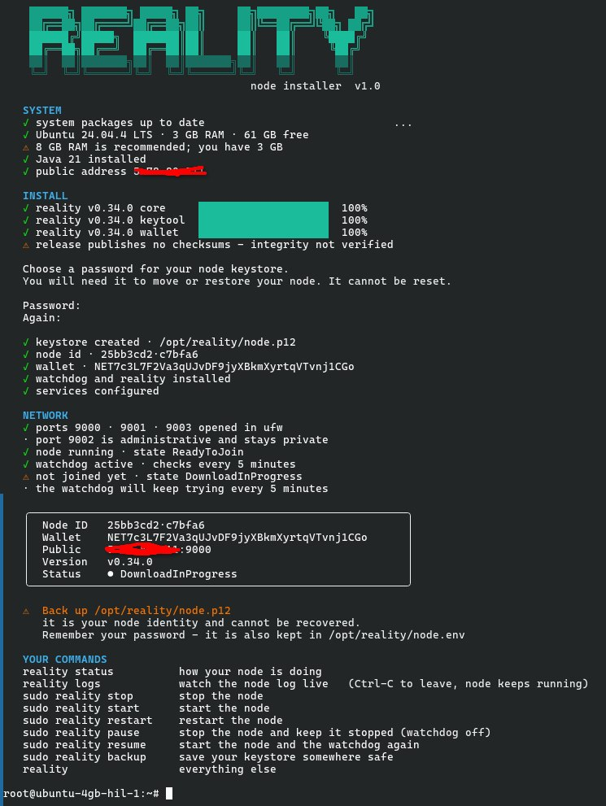

<div align="center">

<br>

# Reality Network · Linux Node

**A validator node that installs in one command and runs itself.**

[](https://github.com/reality-foundation/linux-server/releases/latest)
[](#what-you-need)
[](#it-looks-after-itself)
[](https://discord.gg/nRBUueFRbz)

<br>

```bash
curl -fsSL https://raw.githubusercontent.com/reality-foundation/linux-server/main/install.sh -o install.sh
sudo bash install.sh
```

<br>



<br>
<br>

*Two minutes from a blank server to a node that is running, joined to the network, and looking after itself.*

</div>

<br>

## Why this exists

Running a node used to mean a twelve-step guide, a tmux session you hoped never died, a password sitting in plain sight in `htop`, and a manual update every time a release dropped. Miss one step and your node sat there looking healthy while earning nothing.

This replaces all of it. One command. Then `reality status` whenever you're curious.

<br>

<table>
<tr>
<td width="50%" valign="top">

### ⚡ Installs itself
Updates your system, installs Java, downloads the release, creates your identity, opens the ports, starts the service, joins the network. Asks you for exactly one thing: a password.

</td>
<td width="50%" valign="top">

### 🛡 Runs locked down
Its own unprivileged user. Password kept in a root-only file, never on a command line, never in `ps` or `htop`. Hardened systemd service. Everything in one folder.

</td>
</tr>
<tr>
<td width="50%" valign="top">

### 🔁 Heals itself
A watchdog checks every five minutes that the node is up, in the cluster, and still advancing. Crash, stall, or lost session: it restarts, rejoins through a different peer, or resyncs — in that order, gently first.

</td>
<td width="50%" valign="top">

### ⬆ Updates itself
New releases are installed as they're published. The previous release is always kept, and if a new one fails to start, the watchdog rolls back on its own. Your keystore is never touched.

</td>
</tr>
</table>

<br>

## What you need

| | |
|---|---|
| **Server** | Ubuntu 22.04 or 24.04 (Debian 12+ works too). Any VPS: Hetzner, Netcup, Contabo, DigitalOcean, Vultr. |
| **Hardware** | 8 GB RAM, 40 GB disk. It runs on less; 8 GB is what the network expects. |
| **Network** | A public IPv4 address — every VPS has one. Home connections need ports 9000, 9001 and 9003 forwarded. |
| **Time** | Five minutes, most of it waiting for a download. |

<br>

## Installing

Log in to your server and run the two lines at the top. That's the whole guide.

Along the way it asks you to **choose a keystore password**. Write it down: it protects your node identity and wallet, and nobody can reset it. When it finishes it prints your node ID, your wallet address, and the commands below.

> **Back up `/opt/reality/node.p12` and your password somewhere off the server.**
> `sudo reality backup ~` copies the keystore and shows you the password. That file *is* your node.

<br>

## Looking after it

One command, `reality`, does everything:

| Command | What it does |
|---|---|
| `reality status` | State, ordinal, balance, version, and anything that needs your attention |
| `reality logs` | The live node log. Ctrl-C to leave; the node keeps running |
| `sudo reality stop` · `start` · `restart` | Exactly what they say |
| `sudo reality pause` · `resume` | Stop *and stay stopped* (watchdog off), then bring it all back |
| `sudo reality backup [dir]` | Copy your keystore and show its password |
| `sudo reality update` | Install a new release now rather than waiting for the watchdog |
| `sudo reality rollback` | Go back to the previous release |
| `reality` | The full list |

Your node is working when `reality status` shows **Observing** or **Ready** and the ordinal keeps climbing. Straight after install it sits in **DownloadInProgress** while it catches up with the network — that's normal, go make a coffee.

### What the states mean

| State | Meaning | |
|---|---|---|
| `Ready` | Fully synced and validating | ✅ earning |
| `Observing` | In the cluster and following the chain | ✅ earning |
| `WaitingForReady` | Synced, about to become a validator | nearly there |
| `WaitingForObserving` | Download done, joining consensus | nearly there |
| `DownloadInProgress` | Catching up with the chain. Normal after install; can take a while | syncing |
| `RedownloadInProgress` | Re-syncing after falling behind. The watchdog is on it | syncing |
| `WaitingForDownload` | Joined, waiting for the download to start | syncing |
| `SessionStarted` | Join accepted, waiting for peers to connect back. Stuck here means ports 9000, 9001 and 9003 aren't reachable | check ports |
| `ReadyToJoin` | Running but not in the cluster yet. The watchdog will join it | waiting |
| `Leaving` | Leaving the cluster, usually a restart in progress | recovering |
| `Offline` | Left the cluster. The watchdog will restart and rejoin | recovering |
| *no response* | Not answering: starting up, or stopped. Check `reality service-logs` | check |

`reality status` prints the explanation under the card, so you don't need to remember this.

<br>

## It looks after itself

Every five minutes the watchdog asks four questions:

1. **Is the node answering?** If not: restart. If that keeps failing: restart and rejoin through a different bootstrap peer. If *that* fails: a clean resync. Escalation, not panic.
2. **Is it actually in the cluster?** A node can be "running" and not joined. The watchdog joins it, and rotates bootstrap peers if one is unhealthy.
3. **Is it still earning?** A node can answer every health check, report a healthy state, and be stalled. The watchdog tracks the ordinal and recovers a node whose chain has stopped moving.
4. **Is there a new release?** Download, verify, swap, restart — and roll back automatically if the new release doesn't come up.

It never touches your keystore. To turn automatic updates off, set `AUTO_UPDATE=false` in `/opt/reality/node.conf`.

<br>

## If it doesn't join

It's ports, almost every time. The network has to reach **your** server on 9000, 9001 and 9003 — not just you reaching it. Never open 9002: it is the admin port and listens on localhost only. `reality status` tells you in plain words when that's the problem. On a VPS, check the provider's own firewall in their web console (Hetzner, DigitalOcean and Vultr all have one). At home, forward the ports on your router.

<br>

## Already running a node?

Run the same two commands. The installer takes over your existing node and keeps everything that matters: **your node ID, your wallet, your balance, and the chain you've already downloaded.**

### What it does, in order

1. **Finds your keystore.** From the running node's own command line, from your service file, or from a node folder on disk. A keystore only counts if the node's JAR or `data/` folder sits beside it, so a folder of backup keystores is never mistaken for a node.
2. **Asks before adopting it.** `Import it so you keep your node identity? [Y/n]`. If it finds several, it asks which. Saying no asks again and explains that a new identity is a different wallet with a separate balance.
3. **Copies the keystore** into `/opt/reality/node.p12`. Your original is opened read-only and left exactly where it is.
4. **Recovers your password** from the `--password` in your old service file, so you probably won't be asked for it. If it can't find one, it asks — and a wrong answer just asks again rather than starting over.
5. **Stops and disables your old node** — whatever the service is called — so it can't restart and fight over the ports, or come back on the next boot. Your old service file is kept as `reality-node.service.replaced-<date>`.
6. **Moves your chain data across**, so an established node carries on from where it was instead of resyncing. It's a move, not a copy, so it's instant and doesn't need double the disk.
7. **Starts the new service** and rejoins the network.

### What it never does

- It never writes to, moves, or deletes your original keystore.
- It never overwrites a keystore already installed at `/opt/reality/node.p12`; an explicit `--keystore` moves the existing one to `node.p12.replaced-<date>` first.
- It doesn't touch your old node folder. The summary tells you how much disk it's using and how to remove it once you're happy.

### If something goes wrong

**Nothing is stopped or changed until your keystore is imported and its password verified.** Interrupt the installer before that — or give a password it won't accept — and your old node is still running, still enabled, untouched.

If the new release can't read your old chain data, the node won't start; the installer notices, sets that data aside as `data-unusable-<date>`, and starts a fresh sync automatically. Chain data is only a local copy of the network, so this costs time, never money.

To go back to your old setup entirely, your keystore and JARs are still in their original folder, and your old service file is next to the new one with `.replaced-` in the name.

### If your keystore is somewhere unusual

```bash
sudo bash install.sh --keystore /path/to/your/node.p12
```

<br>

## Where everything lives

```
/opt/reality/
├── node.p12          your node identity — back this up
├── node.conf         settings
├── node.env          keystore password (root only)
├── data/             chain data
├── logs/             node logs
├── bin/              the watchdog and the reality command
├── releases/         current and previous release
└── current           → the release that is running
```

<br>

## Installer options

```
--ip 1.2.3.4          use this public IP instead of detecting it
--password SECRET     set the keystore password without being asked
--keystore PATH       import this keystore instead of searching for one
--heap 4g             JVM heap (default is sized from your RAM)
--no-upgrade          skip the system package upgrade
--no-auto-update      install the watchdog without automatic updates
--no-firewall         leave ufw alone
--uninstall           remove the programs, keep your keystore and data
--uninstall --purge   also delete chain data and settings
```

Running the installer again is always safe. It keeps your keystore, applies any changes, and restarts the node.

**Your keystore is never deleted.** `--uninstall` leaves it in place. Even `--uninstall --purge` copies it to `/root/reality-keystore-<date>/` first and tells you where, so a wallet can't be lost to a mistyped command.

<br>

## Doing it by hand

If you'd rather set everything up yourself, the full step-by-step guide is in [ADVANCED.md](ADVANCED.md).

<br>

<div align="center">

[Documentation](https://docs.realitynet.xyz) · [Discord](https://discord.gg/nRBUueFRbz) · [Telegram](https://t.me/realitynetw0rk) · [Releases](https://github.com/reality-foundation/linux-server/releases)

<br>

<sub>Built for the people who keep the Reality Network running.</sub>

</div>
